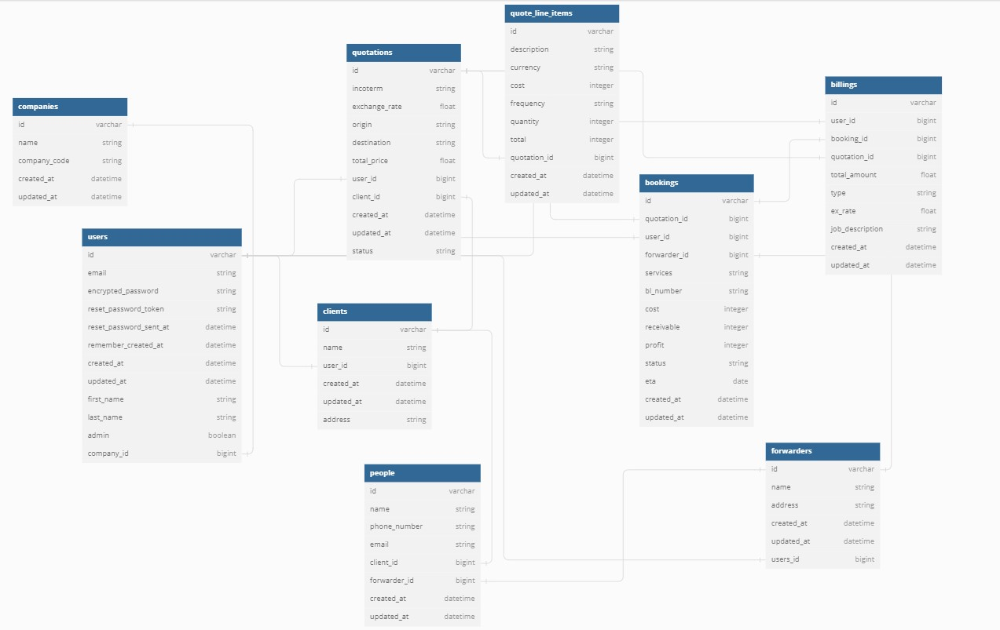

# Development Notes
With this project, I chose to work my way up from the database schema up to the views and implementing tests along the way to emulate the best practice of test-driven development.

## Objective
The goal is to be able to implement a booking management system that would display a user's quotations, bookings, billings, and maybe their contacts. These would be the main pages of the application and I plan to implement turbo frames on each one and see where I can go from there. 

## Schema
I based most of the tables around the spreadsheets commonly used by my wife. I started building tables from Users all the way down to the billings table. It took 2 days to build the base schema which looks like this:


This is just the base I'm working with, which means its likely to change. The current associations are also not set in stone and would be updated as needed.

## Tests
### Setup
To properly set-up FactoryBot and Shoulda-matchers, the following code should be added in `spec/rails_helper.rb`
```ruby
# Should be under Rspec.configure
config.include FactoryBot::Syntax::Methods

# After the configure block
Shoulda::Matchers.configure do |config|
  config.integrate do |with|
    with.test_framework :rspec
    with.library :rails
  end
end

# Not sure if this is needed but I placed:
require 'factory_bot_rails'
# After the built-in comment to "add additional require below this line"
```

To be able to use Devise::Test helpers, the following should be added in `spec/rails_helper.rb`
```ruby
config.include Devise::Test::IntegrationHelpers, type: :request
```
### Implementation
#### Models
- Tests were implemented alongside model associations, validations, and basic methods.
  ```bash
  Finished in 0.97858 seconds (files took 1.71 seconds to load)
  83 examples, 0 failures
  ```
#### Controllers
- As of 05/20/24
  ```bash
  Finished in 1.95 seconds (files took 1.65 seconds to load)
  34 examples, 0 failures, 1 pending
  ```

## Processes Learned
### Scoping with devise
Since I'm allowing user creation under unique companies, I needed to scope users under a company ID:
```ruby
validates :email, presence: true, uniqueness: { case_sensitive: false, scope: :company_id }
```

Due to `devise` it wasn't a walk in the park to just test it and expect it to work on the get go. The following needed to be added in the user model:
```ruby
def will_save_change_to_email?
    false
  end

  def email_changed?
    false
  end
```
I also needed a migration file to add indexes and remove the email index from user:
```ruby
def change
  add_index :users, [:email, :company_id], unique: true
  remove_index :users, :email
end
```
Finally, a config needs to be added in `initializers/devise.rb`:
```ruby
config.authentication_keys = [ :email, :company_id ]
```

#### Resources:
- [Stack Overflow](https://stackoverflow.com/questions/57569530/custom-email-unique-validation-not-working-on-devise)
- [Stack Overflow2](https://stackoverflow.com/questions/18338353/devise-allow-email-uniqueness-within-scope)

#### Thoughts:
At this stage of development, I haven't implemented controllers or views yet. If this causes issues on those fronts, I need to update this.

### CSS with Bootstrap Present on Creation
When I was adding custom fonts, I noticed that `Hotwire::LiveReload` wasn't updating when I made css changes which I found quite weird. Then checking further, I noticed that I can't even add custom css scripts.

Upon searching stack overflow, apparently I'm supposed to watch the css using `yarn watch:css` which would require a separate terminal in order for css changes to be made.

It's also on the scripts under `package.json` in the application's root directory.

### Constraining routes
In this project, I chose to have a constraint added to accessing the admin dashboard. I wanted the user to be authenticated first, then a check to happen if the users `admin` column is true.

Searching through posted questions in StackOverflow, I found this:
```ruby
constraints: lambda { |request| request.env['warden'].user.admin? 
```
I added this constraint when setting my root paths, they are structured this way since the routes are match top to bottom and having the two other root paths above this one would have the admin login to the dashboard index first.

```ruby
authenticated :user do
  root "admin/dashboard#index", as: :admin_root, constraints: lambda { |request| request.env['warden'].user.admin? unless request.env['warden'].user.nil? }
  namespace :admin do
    resources :companies, only: [ :index, :show, :update ]
  end

  root "dashboard#index", as: :auth_root
end
root "pages#index"
```